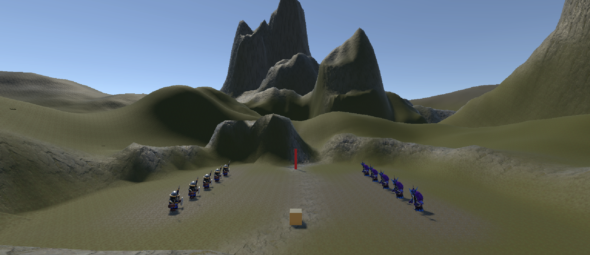

# Práctica 4 Interfaces Inteligentes. Delegados y Eventos

- **Author**: Himar Edhey Hernández Alonso
- **Subject**: Interfaces Inteligentes
- **Course**: Interfaces Inteligentes

## Introducction

In this practice, we will implement a scene in Unity where we will use delegates and events to create interactions between different game objects. The main objective is to understand how to use these programming concepts to manage communication between objects in a decoupled way.

## Ejercicio Extra (Examen Parecido)

Crear una escena donde al pulsar un botón se notifique a una esfera y a un cubo que deben desplazarse, además al chocar con un cilindro todos deben cambiar de color.

## Events and Delegates Exercises

### Exercise 1

*Crea una escena con 5 esferas, rojas que las etiquetas de tipo 1, y verdes de tipo 2. Añade un cubo y un cilindro. Crea la siguiente mecánica: cuando el cubo colisiona con el cilindro, las esferas de tipo 1 se dirigen hacia una de las esferas de tipo 2 que fijes de antemano y las esferas de tipo 2 se desplazan hacia el cilindro.*

For this exercise, ten spheres were placed on the terrain used in previous practices, slightly modifying the area to make room. Five spheres were assigned a blue material and the other five a green material, and each one was tagged with its corresponding type. A cube and a cylinder were also added to the scene. The cylinder was given a red material, and the cube a gold one.

I added to the cube a Rigidbody component to make it a physical object, allowing it to collide with the cylinder. The cylinder was given a Box Collider component to detect collisions. So, for moving the cube, I created a simple script that allows movement using the arrow keys:

```csharp
using UnityEngine;

public class RbMove : MonoBehaviour {
  [SerializeField] private float speed = 10f;
  private Rigidbody rb;

  void Start() {
    rb = GetComponent<Rigidbody>();
  }

  void Update() {
    float verticalInput = Input.GetAxis("Vertical");
    float horizontalInput = Input.GetAxis("Horizontal");

    Vector3 direction = transform.forward * verticalInput + transform.right * horizontalInput;
    Vector3 movement = direction.normalized * speed;
    Vector3 newPosition = rb.position + movement * Time.deltaTime;

    rb.MovePosition(newPosition);
  }
}
```

For managing the interactions, I created a script called  CollisionNotificator, this script is responsible for detecting when the object attached to it collides with another object, sending notifications to subscribed objects when it occurs.

```csharp
using UnityEngine;

public class CollisionNotificator : MonoBehaviour {
  public delegate void CollisionAction();
  public event CollisionAction OnCollision;

  private void OnCollisionEnter(Collision collision) {
    OnCollision?.Invoke();
  }
}
```

Next, I created a Interface called ICollisionObserver, which defines a method that objects must implement to respond to collision notifications.

```csharp
public interface ICollisionObserver {
  void OnNotified();
}
```

With this I can use the observer pattern to manage the interactions between the objects in a clean way. For that I created another script which implements the ICollisionObserver interface. First, for moving the objects I implemented the movement as a teleportation to the target position:

```csharp
using UnityEngine;

public class MoveToOnCollision : MonoBehaviour, ICollisionObserver {
  [SerializeField] private CollisionNotificator collisionNotificator;
  [SerializeField] private Transform targetObject;

  private void Start() {
    collisionNotificator.OnCollision += OnNotified;
  }

  public void OnNotified() {
    MoveToTarget();
  }

  private void MoveToTarget() {
    transform.position = targetObject.position;
  }
}
```


Then, I implemented another script where I move the objects in a smooth way towards the target position:

```csharp
using UnityEngine;

public class SmoothMoveToOnCollision : MonoBehaviour, ICollisionObserver {
  [SerializeField] private CollisionNotificator collisionNotificator;
  [SerializeField] private Transform targetObject;
  [SerializeField] private float speed = 5f;
  private bool shouldMove = false;

  private void Start() {
    collisionNotificator.OnCollision += OnNotified;
  }

  public void OnNotified() {
    shouldMove = true;
  }

  private void Update() {
    if (shouldMove) {
      transform.position = Vector3.MoveTowards(transform.position, targetObject.position, speed * Time.deltaTime);
      if (transform.position == targetObject.position) {
        shouldMove = false;
      }
    }
  }
}
```


### Exercise 2

*Sustituye los objetos geométricos por humanoides.*

For this I replaced the spheres with humanoid models, assigning them the tags corresponding to their types.




### Exercise 3

*Adapta la escena anterior para que existan humanoides de tipo 1 y de tipo 2, así como diferentes tipos de escudos, tipo 1 y tipo 2:*

*- Cuando el cubo colisiona con cualquier humanoide  tipo 2,  los del grupo 1 se acercan a un escudo seleccionado. Cuando el cubo toca cualquier humanoide del grupo 1 se dirigen hacia los escudos del grupo 2 que serán objetos físicos. Si algún humanoide a colisiona con uno de ellos debe cambiar de color.*

### Excercise 4

*Cuando el cubo se aproxima al objeto de referencia, los humanoides del grupo 1 se teletransportan a un escudo objetivo que debes fijar de antemano.Los humanoides del grupo 2 se orientan hacia un objeto ubicado en la escena con ese propósito.*

### Exercise 5

*Implementar la mecánica de recolectar escudos en la escena que actualicen la puntuación del jugador. Los escudos de tipo 1 suman 5 puntos y los de tipo 2 suman 10. Mostrar la puntuación en la consola.*

### Exercise 6

*Partiendo del script anterior crea una interfaz que muestre la puntuación que va obteniendo el cubo.*

### Exercise 7

*Partiendo de los ejercicios anteriores, implementa una mecánica en la que cada 100 puntos el jugador obtenga una recompensa que se muestre en la UI.*

### Exercise 8

*Genera una escena que incluya elementos que se ajusten a la escena del prototipo y alguna de las mecánicas anteriores.*  

### Exercise 9

*Implementa el ejercicio 3 siendo el cubo un objeto físico.*
